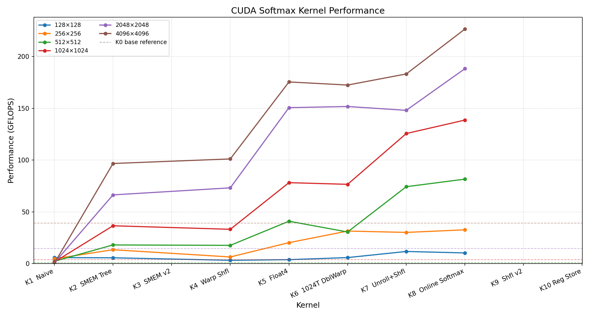

# Fast Softmax — CUDA Kernel Optimization

逐步优化 CUDA Softmax kernel，从单线程基准出发，依次引入共享内存规约、Warp Shuffle、向量化加载、循环展开和 Online Softmax，在 4096×4096 矩阵上最终达到基准的 **5.8×** 加速。

**硬件环境**：NVIDIA GPU，sm_86（Ampere）  
**数据类型**：float32  
**矩阵规模**：方阵 N×N，N ∈ {128, 256, 512, 1024, 2048, 4096}，沿行方向做 Softmax

---

## 目录

- [Softmax 算法](#softmax-算法)
- [Kernel 实现与改进](#kernel-实现与改进)
- [性能对比](#性能对比)
- [运行方式](#运行方式)

---

## Softmax 算法

对行向量 $x = [x_0, x_1, \dots, x_{N-1}]$，数值稳定的 Softmax 公式为：

$$\text{softmax}(x_i) = \frac{e^{x_i - \max(x)}}{\sum_j e^{x_j - \max(x)}}$$

减去行最大值在数学上等价（分子分母同除 $e^{\max}$），但可防止 $e^{x_i}$ 上溢。

标准实现需要 **3 次遍历（Pass）**：
1. Pass 1：扫描全行，求 max
2. Pass 2：扫描全行，求 $\sum e^{x_i - \max}$
3. Pass 3：扫描全行，写出归一化结果

Softmax 是典型的 **memory-bound** 操作——算术量（exp、fmaxf）远小于 HBM 带宽消耗，优化核心在于减少全局内存访问次数和提高访问效率。

---

## Kernel 实现与改进

### K0 — Base（单线程基准）

```
每个线程独立负责一整行，串行执行 3-pass softmax。
```

每行分配 1 个线程，顺序读取、计算、写出，无任何线程协作。访问模式非合并（stride = totalCol），HBM 带宽利用率极低。所有后续 kernel 均以此为对比基准。

---

### K1 — Naive（2D Block）

```
dim3 block(32, 32)：每个线程块处理 32 行 × 32 列，
每行由 32 个线程协作，每线程负责 totalCol/32 个元素。
```

**改进**：引入多线程协作，每行由一组线程并行处理，线程级并行度提升。  
**瓶颈**：每个线程仍需独立遍历各自负责的列，访问模式为 stride=32 的跳跃访问，cache line 利用率低；规约阶段无共享内存协作，仍为串行。随 N 增大，每线程工作量线性增长，GFLOPS 持续下降。

---

### K2 — SMEM Tree Reduction（共享内存树形规约）

```
dim3 block(BLOCK_DIM_X=1024, 1)：整个 block 协作处理一行，
共享内存 reduction[1024] 存储中间规约结果。
```

**改进**：所有 1024 个线程合力处理一行，消除了 K1 的串行遍历。采用共享内存树形规约：每轮 stride 减半，活跃线程减半，$\log_2(1024) = 10$ 步完成 block 内规约。访问模式改为合并访问（连续线程读连续地址），HBM 带宽利用率显著提升。

**瓶颈**：树形规约需要 10 次 `__syncthreads()` / pass × 3 pass = 30 次全 block 屏障；共享内存读写各 10 次 / pass，延迟约 400–600 cycles / pass。

---

### K4 — Warp Shuffle 两级规约

```
dim3 block(BLOCK_DIM_X=1024, 1)：同 K2，
但规约方式改为 warp shuffle + 少量 smem。
```

**改进**：将 K2 的纯共享内存树形规约替换为两级规约：

- **Level 1**：warp 内 `__shfl_xor_sync` 蝶形规约（5 步，0 次 `__syncthreads`），结果留在寄存器
- **Level 2**：各 warp lane0 写入共享内存，warp0 再做一轮 shuffle 规约

| 对比项 | K2（SMEM Tree） | K4（Warp Shuffle） |
|--------|----------------|-------------------|
| syncthreads / pass | 11 次 | 2 次 |
| smem 读写 / pass | 各 10 次 | 各 1 次 |
| smem 占用 | 4096 B | 128 B |
| 规约延迟估算 | ~400–600 cycles | ~65–95 cycles |

`__shfl_xor_sync` 使用专用寄存器交换硬件，延迟仅 ~4–5 cycles vs smem 的 ~20–30 cycles。smem 占用从 4096 B 降至 128 B，同一 SM 可驻留更多 block，提升 TLP。

---

### K5 — Float4 向量化加载

```
dim3 block(BLOCK_DIM_X=1024, 1)：Level 1 同 K4（warp shuffle），
Level 2 改回 smem 树形规约；HBM 加载改为 float4。
```

**改进**：将标量 `float` 加载改为 `float4`（16 bytes / 指令），每条 load 指令传输数据量提升 4×：

- **指令数减少 4×**：调度器空出的 issue slot 由 FMA 填充，流水线更满
- **循环次数减少 4×**：branch、counter、AGEN 指令开销降低 4×
- **单次 load 返回 4 个 float 同时就绪**：后续 4 次 fmaxf/expf 可立即连续发射，无需等待下一条 load

三点均由同一改变（load 宽度 ×4）在不同维度上体现，Level 2 规约退回 smem 树形对总体影响有限。

---

### K6 — 1024 线程双 Warp 规约

```
dim3 block(BLOCK_DIM_X=1024, 1)：float4 加载（同 K5），
Level 2 规约改为 warp0 再次 shuffle（同 K4 思路）。
```

**改进**：在 K5 的 float4 基础上，将 Level 2 从 smem 树形规约（5 次 `__syncthreads`）改为 warp0 再次 `__shfl_xor_sync`（0 次 `__syncthreads`）：

- syncthreads / pass：K5 的 6 次 → K6 的 2 次
- smem 读写 / pass：各 10 次 → 各 1 次

结合 float4 向量化与双级 warp shuffle 规约，两项优化叠加。512 维及以下因 block 数量少、occupancy 偏低，效果与 K5 相当；大尺寸下收益明显。

---

### K7 — #pragma unroll + shfl_down_sync

```
在 K6 基础上：
1. 主数据循环加 #pragma unroll URF（URF=4）
2. 规约从 __shfl_xor_sync 改为 __shfl_down_sync
```

**改进**：

**循环展开（#pragma unroll URF=4）**：将主加载循环展开 4 份，每次迭代同时发出 4 条 float4 load，地址间隔 16384 bytes，互相独立：

- **MLP（Memory Level Parallelism）**：4 条 load 同时在途，带宽利用率从 <100% 向峰值靠近（occupancy 低时效果明显）
- **延迟隐藏**：编译器将 4 条 load 集中提前发射，在等待返回期间（~200–400 cycles）执行已就绪数据的 fmaxf，计算填满等待窗口
- **循环控制开销**：branch + counter 指令减少 4×

**shfl_down_sync**：单向规约，只有 lane0 持有最终结果，与 xor_sync 相比指令数相同（SIMT 下所有 lane 仍执行相同指令），无性能差异，仅因后续只需 lane0 写 smem 而更语义清晰。

---

### K8 — Online Softmax（Pass 合并）

```
在 K7 基础上，将 Pass1（求 max）和 Pass2（求 sum）合并为一次遍历，
规约改回 __shfl_xor_sync。
```

**改进**：

**核心改进——减少一次全局内存读取**：

| | K7 | K8 |
|-|----|----|
| HBM 读次数 | 2（Pass1 + Pass2） | 1（合并 Pass） |
| HBM 写次数 | 1（Pass3） | 1（Pass3） |

对 totalCol=4096，每行节省 16 KB 读带宽，**减少 50% 全局内存读取**。

**在线合并公式**：同时维护 (maxVar, divisor) 对，每读入一批元素：
$$d_{\text{new}} = d_{\text{hist}} \cdot e^{m_{\text{hist}} - m_{\text{new}}} + d_{\text{batch}} \cdot e^{m_{\text{batch}} - m_{\text{new}}}$$

**必须用 `__shfl_xor_sync`**：在线合并规约中，两端 lane 需互相持有对方的 (max, div) 才能正确缩放各自的 divisor；`__shfl_down_sync` 中高 lane 越界后返回自身值，无法看到低 lane 的 max，导致 divisor 未缩放，结果错误。

Pass3 额外优化：预计算 `inv_divisor = 1.0f / divisor`，将除法改为乘法（`val × inv_divisor`），减少除法指令数。

---

## 性能对比

单位：GFLOPS（越高越好）

| Size | K0 Base | K1 Naive | K2 SMEM Tree | K4 Warp Shfl | K5 Float4 | K6 1024T DblWarp | K7 Unroll+Shfl | K8 Online Softmax |
|------|--------:|---------:|-------------:|-------------:|----------:|-----------------:|---------------:|------------------:|
| 128  | 0.0     | 5.9      | 5.7          | 3.3          | 3.9       | 5.9              | 11.8           | 10.4              |
| 256  | 0.2     | 4.7      | 13.5         | 6.5          | 20.3      | 31.5             | 30.2           | 32.7              |
| 512  | 1.0     | 2.3      | 18.1         | 17.7         | 41.0      | 30.6             | 74.3           | 81.6              |
| 1024 | 3.9     | 1.6      | 36.6         | 33.2         | 78.2      | 76.6             | 125.6          | 138.6             |
| 2048 | 14.6    | 0.8      | 66.4         | 73.2         | 150.6     | 151.7            | 148.0          | 188.2             |
| 4096 | 39.2    | 0.4      | 96.7         | 101.1        | 175.4     | 172.4            | 183.1          | 226.4             |

**K8 vs K0（4096×4096）**：226.4 / 39.2 = **5.8×**

<!-- performance_plot -->

<!-- performance_plot -->

> 虚线为 K0 base reference，与对应维度折线同色。

---

## 运行方式

### 构建

```bash
cmake -DSOFTMAX_VARIANT=8 -DBLOCK_DIM_Y=1024 -DUNROLL_FACTOR=4 -DWIDTH=0 \
      -DCMAKE_BUILD_TYPE=Release -G Ninja -S . -B cmake-build-release
ninja -C cmake-build-release -j$(nproc)
```

### 运行 benchmark

```bash
./run.sh          # 依次运行所有 kernel，结果写入 benchmark_results/
```

### 绘图

```bash
uv run plot_performance.py          # 绘制全部维度
python3 plot_performance.py 1024 4096  # 指定维度
```
